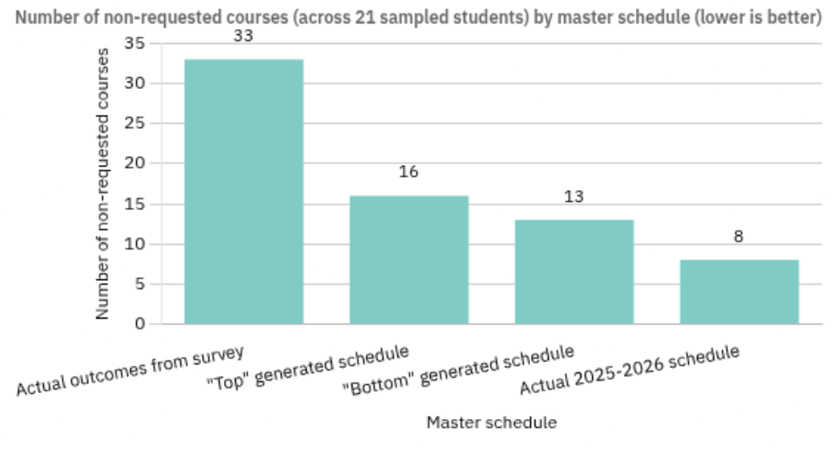
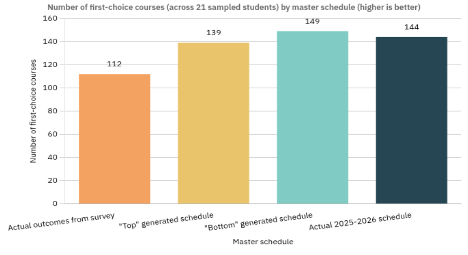
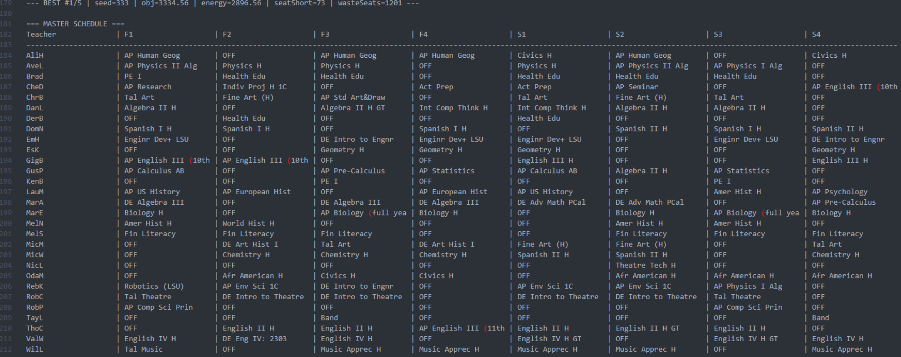
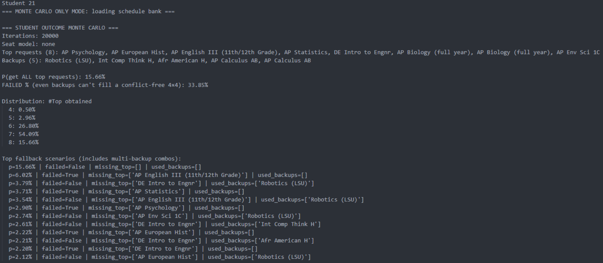
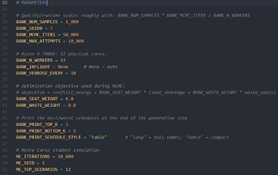
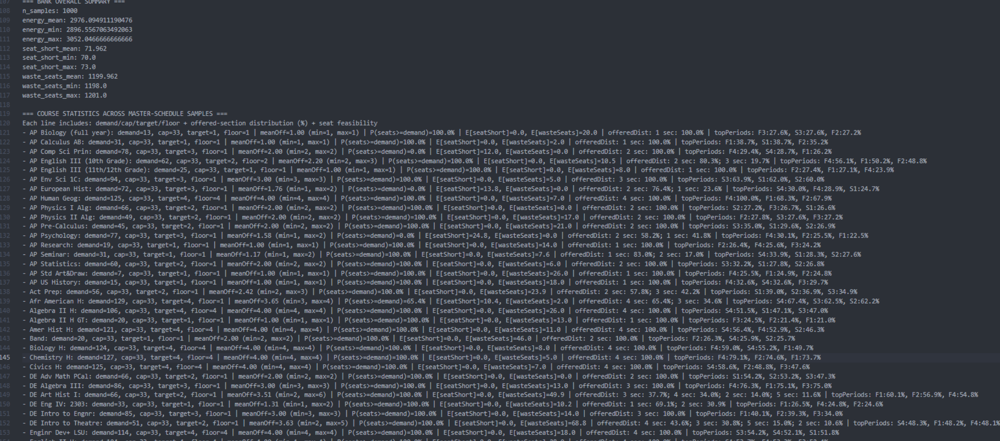

# Dirichlet-Multinomial-School-Scheduler

I built this tool to investigate whether a probabilistic approach could be used to generate better high school master schedules and estimate the likelihood that students receive the courses they request.

This was a science fair project I made in 12th grade. The project won 1st place in the Mathematics category at the Louisiana state competition and 3rd place in the Mathematics & Systems Software category at the Greater New Orleans regional competition, along with a few special awards.

## Background and Research Question

High school master scheduling, sometimes called *timetabling*, is the process of assigning courses, teachers, and periods for an entire school. It is a difficult **NP-hard optimization problem** because changing one part of the schedule can create conflicts somewhere else.

At my high school, as at many others, students almost never receive all of the classes they requested.

I wanted to investigate whether an algorithm could do two things:

1. Generate valid master schedules while trying to reduce student conflicts.
2. Estimate the probability that a student would receive their requested courses.

The main research question was:

> **How effectively can a probabilistic, conflict-aware master schedule generator reduce student scheduling conflicts, and how accurately can it estimate the probability that students receive their requested courses?**

## How It Works

The program has three main parts.

### 1. Generating Section Counts

The first part decides how many sections of each course should be offered.

I used a **Dirichlet-multinomial model** to add some randomness to the section allocation rather than always producing exactly the same numbers. Before sampling, the program checks the school's hard constraints using a modified **Dinic max-flow algorithm**.

These constraints include:

* Maximum class sizes
* Teacher eligibility
* Required numbers of sections
* My high school's 4x4 block structure
* Course-specific constraints

The goal is to make sure that every schedule generated later is actually feasible.

### 2. Placing Courses Into Periods

Once the number of sections has been determined, the program needs to decide when those sections should occur.

My high school uses an 8-block schedule: Fall 1st-4th Period and Spring 1st-4th Period

I used **MCMC simulated annealing** to search through possible period assignments. The program gives each schedule an objective score based on:

* Student course-request conflicts
* Teacher scheduling constraints
* Seat shortages

A simplified version of the objective function is:

$$\textbf{Energy} = \textbf{Conflict Energy} + w_{\text{seat}} \cdot \textbf{Seat Shortage}$$

The simulated annealing process then tries to find schedules with lower energy.

### 3. Simulating Student Outcomes

The final part of the project is the Monte Carlo simulation.

Instead of testing one student on one schedule, I generated a bank of **1,000 valid master schedules** and used that same bank for the simulations.

For each student, the program takes:

* 8 first-choice course requests
* 4 ranked backup choices

It then simulates how that student could be scheduled under the different generated master schedules.

After many iterations, the program produces estimated probabilities and distributions for things like:

* How many requested courses the student receives
* How many first-choice courses the student receives
* How many non-requested courses the student receives

## Experimental Setup

My high school gave me an anonymized course request matrix representing approximately **600 students** and more than **60 course offerings**.

I also collected anonymous survey data from 11th and 12th grade students. The survey asked for:

* Their 8 first-choice course requests for the 2025–2026 school year
* Their ranked backup choices
* Their original 2025–2026 schedule

The program was then tested using the survey data and my high school's actual master schedule. **21** students filled out the survey.


The comparisons looked at four different conditions:

* The generated schedule with the **highest objective score**
* The generated schedule with the **lowest objective score**
* The actual 2025–2026 master schedule
* The actual student outcomes from the survey

For the statistical comparisons, I looked mainly at:

* The number of non-requested courses assigned to each student
* The number of first-choice courses assigned to each student

Paired *t*-tests were used for the comparisons between individual student outcomes.

I also used **chi-square goodness-of-fit tests** to compare the Monte Carlo probability distributions against observed outcomes.

## Results

The Monte Carlo simulation produced probability distributions that were very similar to the observed student outcomes.

The chi-square goodness-of-fit test comparing the Monte Carlo predictions to the survey outcomes produced:

$$
p = 0.9137
$$

The other probability comparisons also produced very large *p*-values, including:

$$
p = 0.9999
$$

when comparing the predicted conflict distributions with the different scheduling baselines.

### Student Conflicts

For the schedule with the highest objective score:

$$
16 \text{ vs. } 33
$$

non-requested courses.

This is a **51.52% reduction** compared to the survey outcomes.

The paired *t*-test gave:

$$
p = 0.0038,\qquad n = 21
$$

However, the highest-scoring generated schedule was not consistently the best-performing condition.

For example, compared with the lowest-scoring generated schedule:

$$
16 \text{ vs. } 13
$$

non-requested courses, with:

$$
p = 0.2094
$$

When compared with the actual 2025–2026 master schedule:

$$
16 \text{ vs. } 8
$$

non-requested courses.

The actual master schedule therefore performed better on this particular metric than the schedule produced by my optimization.

### First-Choice Courses

The highest-scoring generated schedule resulted in:

$$
112
$$

first-choice courses, compared with:

$$
139
$$

in the survey outcomes.

The paired *t*-test gave:

$$
p = 4.20 \times 10^{-4}
$$

Again, the highest-scoring generated schedule was not always the best-performing condition. The lowest-scoring generated schedule resulted in more first-choice courses than the highest-scoring one.

This showed that the objective function I designed was not perfectly aligned with every student outcome I was measuring.

### Graphs





## Takeaways

The most interesting result of the project was that **optimizing the master schedule is not necessarily the same thing as optimizing the schedules students actually receive**.

The generated schedules were mathematically feasible and could reduce conflicts, but they did not consistently outperform my high school's actual master schedule when comparing final student outcomes.

At the same time, the actual master schedule was capable of supporting relatively good outcomes, while the schedules students actually received contained substantially more conflicts.

This suggests a possible **"placement gap"** between having a feasible master schedule and actually placing individual students into sections. A schedule can satisfy its structural constraints and have enough available sections while students still end up with schedules containing significant conflicts.

That distinction ended up being more interesting to me than simply finding the schedule with the lowest objective function. It suggests that the student placement process may be an important part of the problem that is not captured by master-schedule optimization alone.

## Limitations & Likely Explanations

There are several reasons why the results did not line up perfectly with the objective function.

First, the model was designed around **my high school's specific scheduling system**, so the approach is not necessarily generalizable to other schools.

Second, the objective function is only an approximation of what makes a schedule "good." In particular, the relatively strong weight placed on seat capacity may have caused the optimizer to favor schedules that scored well mathematically without necessarily maximizing the outcomes I ultimately cared about.

There was also some stochastic variation from the optimization process itself. The search does not guarantee that the best schedule found is the globally optimal one.

The optimization was run on a single consumer desktop rather than a large computing cluster, which limited how many schedules and iterations I could explore.

Finally, the student survey dataset was relatively small compared with the total student population. The results therefore should not be interpreted as a complete picture of every student's experience at my high school.

## Screenshots








## Project Structure

The main files and folders in the repository are:

```text
main.py
data/
secondary_programs/
```

* `main.py`: Main program containing the schedule generation, optimization, and Monte Carlo simulation code.
* `data/`: Anonymized input data and generated schedule information.
* `secondary_programs/`: Smaller programs for data inspection and other parts of the project.

Some generated schedule data is stored using Python pickle files (`.pkl`).

## Running the Project

### Requirements

* Python 3
* NumPy

Install the required packages:

```bash
pip install -r requirements.txt
```

Run the main program:

```bash
python main.py
```

The program can also generate a new schedule bank instead of using the existing one. The exact behavior is controlled by the configuration variables in `main.py`.

Because schedule generation is computationally expensive, using the included schedule bank is much faster than regenerating all of the schedules from scratch.

## Future Research

There are several directions I would pursue with more time and computing resources.

One would be to refine the objective function so that student preferences are balanced more carefully against seat capacity and other constraints.

Another would be to model the **student placement process** directly rather than treating it as something that happens after the master schedule is generated. This could help explain the placement gap much more directly.

It would also be useful to generate much larger schedule banks with HPCs and test whether the results become more stable as the search space is explored more thoroughly.

Finally, the system could be adapted to other scheduling structures, such as traditional 7-period schedules instead of the 4x4 block schedule used by my high school.

## Select References

1. Abramson, D. "Constructing School Timetables Using Simulated Annealing: Sequential and Parallel Algorithms." *Management Science*, vol. 37, no. 1, 1991, pp. 98–113.
2. Blei, D. M., Ng, A. Y., & Jordan, M. I. "Latent Dirichlet Allocation." *Journal of Machine Learning Research*, vol. 3, 2003, pp. 993–1022.
3. de Valpine, P., & Harmon-Threatt, A. N. "General Models for Resource Use or Other Compositional Count Data Using the Dirichlet-multinomial Distribution." *Ecology*, vol. 94, no. 12, 2013, pp. 2678–2687.
4. Hao, X., Liu, J., Zhang, Y., & Sanga, G. "Mathematical Model and Simulated Annealing Algorithm for Chinese High School Timetabling Problems under the New Curriculum Innovation." *Frontiers of Computer Science*, vol. 15, no. 1, 2020.
5. Kiyohara, M. "High School Course Scheduling: Student Preferences and Fairness Constraints." *Proceedings of the AAAI Conference on Artificial Intelligence*, vol. 39, no. 28, 2025.
6. Rudová, H., & Murray, K. "University Course Timetabling with Soft Constraints." *Lecture Notes in Computer Science*, 2003.
